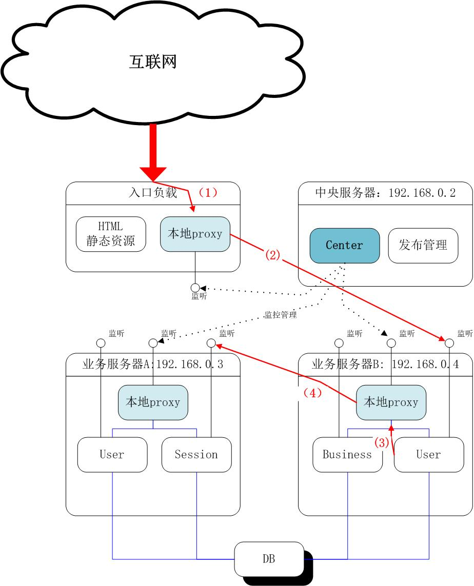

#简介

公司有基于http restapi写的一套系统，面临大量需求变更，所以想平滑切换到微服务模式，诞生了这个项目。

本项目是基于swoole 和 php 编写的，基于http协议的微服务轻量中间件，主动管理模式。

## 实现功能：

### 1. 集中控制管理

中央服务器集中统一管理配置、监控和管理。

### 2. 请求失败主动重试一次

本地代理在反向代理应用服务请求的时候，如果目标服务器返回不是200，会尝试换一个节点再试一下（只再试一次）

### 3. rewrite请求

参数不变的情况下，可以将请求由/a/b/c换成/x/y/z

### 4. 日志记录

支持按日分割，区分记录代理转发记录，节点错误记录，管理命令日志，系统日志等

## 局限性

定位中小型系统的微服务中间件：

* 负载只实现简单的轮询
* 协议只支持http（内部通讯没用也没试过https），识别处理了get,post,raw,cookie,其他没有处理
* 日志是文件日志，分区center、proxy，以及系统、代理请求，每天一个文件，参看 [日志说明](docs/Logs.md)
* 不支持同一个serviceModule下多个方法在多个不同的node里实现（比如 /aa/bb/cc 在pay里实现，/aa/xx/eeee在biz里实现）
* response的content-type尝试识别了json，没考虑xml
* 自主管理模式：proxy不会主动上报自身情况，center也不会主动发现，宕机由每个proxy自行处理
* proxy代理请求时，如果发现问题（httpcode不等于200），会进行一次（且只进行一次）换节点重试。同时，默认的，proxy会发报警邮件（ProxyAlert类中实现，请求项目中附带的那个发邮件的微服务，腾讯企业邮箱测试通过）

# 使用方法

## 部署

名词

- **module**：  服务模块，http请求路径的根路径（http://1.2.3.4:8080/uc/user/login 中uc就是一个module）
- **center**： 中央管理服务器，目前不支持主备负载。出现问题需要向各个proxy发重置centerIP的命令
- **proxy**： 部署在各个服务器上的代理服务
- **node**: 服务节点，一个微服务实例。一个微服务内可以提供多个服务模块

一台服务器上：

- 只有一个proxy
- 0个或多个node
- 每个node配置成所有请求向本地的proxy发送，由proxy代理

**一个典型的网络拓扑：**

下面举个例子来说明下主要流程：来自互联网上一个登入请求，访问user模块，user模块需要访问session模块

1. 入口负载那里接收到外网请求/uc/user/login，转发到预定的统一代理proxy（途中是入口负载服务器上的Proxy）
2. 该proxy根据配置，按负载规则找到一个user模块，把请求转发到模块对应服务器上的指定端口（假定由.4服务器上的User负责）
3. user模块处理过程中发现需要访问session模块的createSession，把请求发送到本地的proxy的回送监听端口
4. .4服务器上的proxy在收到本机的服务请求后，按负载规则找到一个session模块，把请求转发到模块对应服务器上的指定端口（假定是.3）
5. 处理完后依次返回结果

## 环境安装

参看 [环境安装说明](docs/EnvInstall.md)

## 配置
 
参看 [配置说明](docs/Config.md)

## 管理维护操作

参看 [操作手册](docs/Cmds.md)

## 代码设计说明

参看 [设计说明](docs/Design.md)